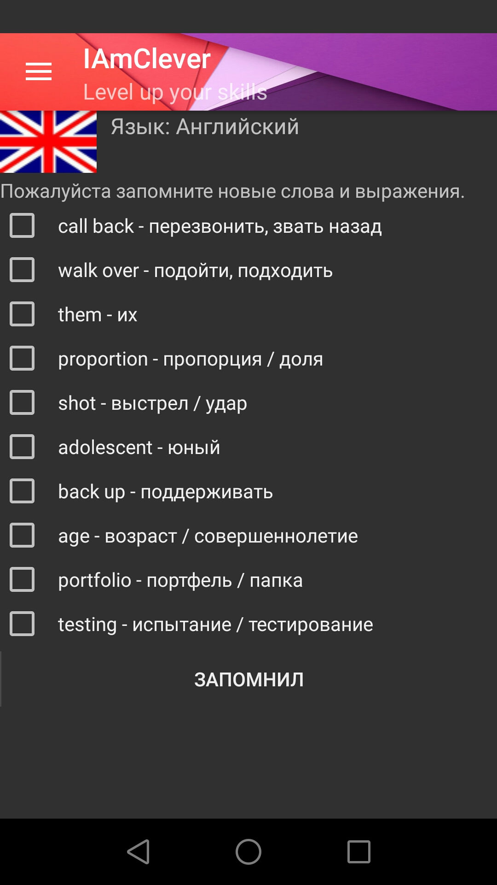

# IanClever

Программа для изучения иностранных языков. 
Суть заключается в регулярном запоминании слов различных языков по уровням, с последующим проведением экзаменов проверок, оценке знаний. 
Доступен следующий функционал: 
- настройка времени запуска обучения и проверки знаний по времени и дням недели 
- настройка для работы с различными языками (английский, немецкий) 
- загрузка новых слов с сервера, обновление словарей 
- сравнение успеха пользователя в обучении с другими пользователями в виде таблицы результатов 
- вывод статистики обучения в виде графиков 
  

